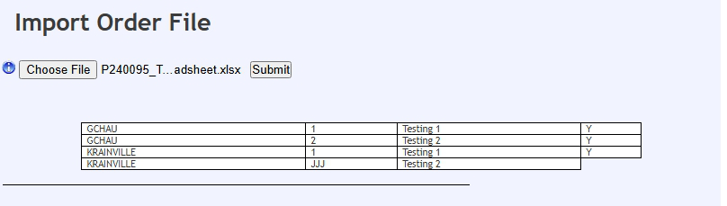
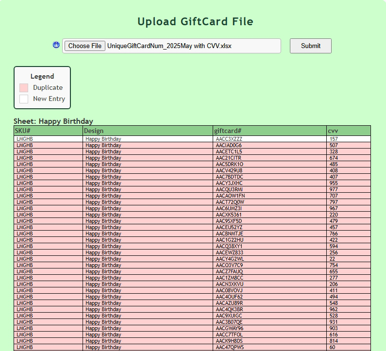

## Projects I worked on during my internship at littleton-coin

❗❗❗ **NOT OPEN SOURCE** ❗❗❗

---
### WavePick Search
1. wavepicksearch program used to search for a specific sku within the database
2. wavepicksearch display used to display the site and perform the search
3.

---
### ImportOrder File
1. model for my import order file program, includes db2 function calls to database
2. using phpSpreadsheet to call file and read the spreadsheet
3. use parameters and ajax calls to submit the order file with swal alerts for errors

---
### Print Invoices
1. controller model MVC Paradigm for Invoice print program, calls all printers and displays invoices
2. Update invoices with update functionallity form control, and printer availability through ajax
3. invoice print display for printers available, invoices ready, moving invoices to printers
4. javascript calls to build functional buttons and reload the page through ajax calls

---
### Upload GiftCard
1. mvc paradigm with model stored procedure functions
2. created sql scripts to create store procedures from the database using mocha/acs
3. swal alerts and css for styling and error checking as well as setting parameters
4. using phpSpreadsheet to read in the file as well as look for duplicates by sorting through data
5. checking for duplicates after event handler to automatically alert users for duplicates highlighted red
6. read all sheets using phpSpreadsheet iterating through the entire workbook.

